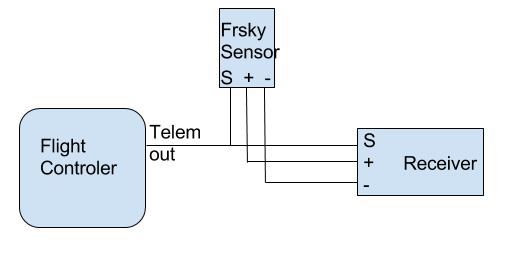

# Telemetry

Telemetry allows you to know what is happening on your aircraft while you are flying it.  Among other things you can receive battery voltages and GPS positions on your transmitter.

Telemetry can be either always on, or enabled when armed.  If a serial port for telemetry is shared with other functionality then telemetry will only be enabled when armed on that port.

Telemetry is enabled using the 'TELEMETRY` feature.

```
feature TELEMETRY
```

Multiple telemetry providers are currently supported, FrSky, Graupner
HoTT V4, SmartPort (S.Port), LightTelemetry (LTM) and Ibus

All telemetry systems use serial ports, configure serial ports to use the telemetry system required.

## FrSky telemetry

FrSky telemetry is transmit only and just requires a single connection from the TX pin of a serial port to the RX pin on an FrSky telemetry receiver.

FrSky telemetry signals are inverted.  To connect a cleanflight capable board to an FrSKy receiver you have some options.

1. A hardware inverter - Built in to some flight controllers.
2. Use software serial and enable frsky_inversion.
3. Use a flight controller that has software configurable hardware inversion (e.g. STM32F30x).

For 1, just connect your inverter to a usart or software serial port.

For 2 and 3 use the CLI command as follows:

```
set tlm_inversion = ON
```


### Available sensors

The following sensors are transmitted :

Vspd : vertical speed, unit is cm/s.

Hdg : heading, North is 0°, South is 180°.

AccX,Y,Z : accelerometers values.

Tmp1 : baro temp if available, gyro otherwise.

RPM : if armed : throttle value, battery capacity otherwise. (Blade number needs to be set to 12 in Taranis).

VFAS : actual vbat value (see VFAS precision section bellow).

Curr : actual current comsuption, in amp.

Fuel : if capacity set :remaining battery percentage, mah drawn otherwise.

GPS : GPS coordinates.

Alt : barometer based altitude, init level is zero.

Date : time since powered.

GSpd : current speed, calculated by GPS.

GAlt : GPS altitude, sea level is zero.

Tmp2 : number of sats. Every second, a number > 100 is sent to represent GPS signal quality.

Cels : average cell value, vbat divided by cell number.

> Cleanflight will send Cels (FLVSS Individual Cell Voltages Telemetry), disable the setting to use actual FLVSS sensor with: 
> ```
> set telemetry_send_cells = OFF
> ```
> 
> Note: cell voltage values are an assumed reputation of the cell voltage based on the packs voltage. Actual cell voltage may differ.
>
> To view individual cells or more importantly to get lowest cell (all cells are the sum of vbat, so each cell is the same in this case):
> See [OpenTX 2.1 & FrSky FLVSS Individual Cell Voltages](http://openrcforums.com/forum/viewtopic.php?t=7266).
> Add a new sensor, to display the lowest cell voltage set it up like this:
> - Type: Calculated
> - Formula: Cell
> - Cell Sensor: Cels _(pack total voltage, sum of all cells)_
> - Cell Index: Lowest

### Precision setting for VFAS

Cleanflight can send VFAS (FrSky Ampere Sensor Voltage) in two ways:

```
set frsky_vfas_precision  = 0
```
This is default setting which supports VFAS resolution of 0.2 volts and is supported on all FrSky hardware.

```
set frsky_vfas_precision  = 1
```
This is new setting which supports VFAS resolution of 0.1 volts and is only supported by OpenTX radios (this method uses custom ID 0x39).


## HoTT telemetry

Only Electric Air Modules and GPS Modules are emulated.

Use the latest Graupner firmware for your transmitter and receiver.

Older HoTT transmitters required the EAM and GPS modules to be enabled in the telemetry menu of the transmitter. (e.g. on MX-20)

Serial ports use two wires but HoTT uses a single wire so some electronics are required so that the signals don't get mixed up.  The TX and RX pins of
a serial port should be connected using a diode and a single wire to the `T` port on a HoTT receiver.

Connect as follows:

* HoTT TX/RX `T` -> Serial RX (connect directly)
* HoTT TX/RX `T` -> Diode `-(  |)-` > Serial TX (connect via diode)

The diode should be arranged to allow the data signals to flow the right way

```
-(  |)- == Diode, | indicates cathode marker.
```

1N4148 diodes have been tested and work with the GR-24.

As noticed by Skrebber the GR-12 (and probably GR-16/24, too) are based on a PIC 24FJ64GA-002, which has 5V tolerant digital pins.

Note: The SoftSerial ports may not be 5V tolerant on your board.  Verify if you require a 5v/3.3v level shifters.

## LightTelemetry (LTM)

LTM is a lightweight streaming telemetry protocol supported by a
number of OSDs, ground stations and antenna trackers.

The Cleanflight implementation of LTM implements the following frames:

* G-FRAME: GPS information (lat, long, ground speed, altitude, sat
  info)
* A-FRAME: Attitude (pitch, roll, heading)
* S-FRAME: Status (voltage, current+, RSSI, airspeed+, status). Item
  suffixed '+' not implemented in Cleanflight.
* O-FRAME: Origin (home position, lat, long, altitude, fix)

In addition, in the inav (navigation-rewrite) fork:
* N-FRAME: Navigation information (GPS mode, Nav mode, Nav action,
  Waypoint number, Nav Error, Nav Flags).

LTM is transmit only, and can work at any supported baud rate. It is
designed to operate over 2400 baud (9600 in Cleanflight) and does not
benefit from higher rates. It is thus usable on soft serial.

More information about the fields, encoding and enumerations may be
found at
https://github.com/stronnag/mwptools/blob/master/docs/ltm-definition.txt

## MAVLink telemetry

MAVLink is a very lightweight, header-only message marshalling library for micro air vehicles. 
Cleanflight supports MAVLink for compatibility with ground stations, OSDs and antenna trackers built
for PX4, PIXHAWK, APM and Parrot AR.Drone platforms.

MAVLink implementation in Cleanflight is transmit-only and usable on low baud rates and can be used over soft serial.

## SmartPort (S.Port)

Smartport is a telemetry system used by newer FrSky transmitters and receivers such as the Taranis/XJR and X8R, X6R and X4R(SB).

More information about the implementation can be found here: https://github.com/frank26080115/cleanflight/wiki/Using-Smart-Port

### Available sensors

The following sensors are transmitted :

A4 : average cell value. Warning : unlike FLVSS sensors, you do not get actual lowest value of a cell, but an average : (total lipo voltage) / (number of cells)

Alt : barometer based altitude, init level is zero.

Vspd : vertical speed, unit is cm/s.

Hdg : heading, North is 0°, South is 180°.

AccX,Y,Z : accelerometers values.

Tmp1 : actual flight mode, sent as 4 digits. Number is sent as (1)1234. Please ignore the leading 1, it is just there to ensure the number as always 5 digits (the 1 + 4 digits of actual data) the numbers are aditives (for example, if first digit after the leading 1 is 6, it means GPS Home and Headfree are both active) :

1. 1 is GPS Hold, 2 is GPS Home, 4 is Headfree
2. 1 is mag enabled, 2 is baro enabled, 4 is sonar enabled
3. 1 is angle, 2 is horizon, 4 is passthrough
4. 1 is ok to arm, 2 is arming is prevented,  4 is armed

Tmp2 : GPS lock status, Number is sent as 1234, the numbers are aditives :

1. 1 is GPS Fix, 2 is GPS Home fix
2. not used
3. not used
4. number of sats

VFAS : actual vbat value.

GAlt : GPS altitude, sea level is zero.

GSpd : current speed, calculated by GPS.

GPS : GPS coordinates.

Cels : average cell value, vbat divided by cell number.

> Cleanflight will send Cels (FLVSS Individual Cell Voltages Telemetry), disable the setting to use actual FLVSS sensor with: 
> ```
> set telemetry_send_cells = OFF
> ```
> 
> Note: cell voltage values are an assumed reputation of the cell voltage based on the packs voltage. Actual cell voltage may differ. It is recommeded that you chain the flight controllers telemetry with a real Frsky FLVSS s.port sensor.
>
> To view individual cells or more importantly to get lowest cell (all cells are the sum of vbat, so each cell is the same in this case):
> See [OpenTX 2.1 & FrSky FLVSS Individual Cell Voltages](http://openrcforums.com/forum/viewtopic.php?t=7266).
> Add a new sensor, to display the lowest cell voltage set it up like this:
> - Type: Calculated
> - Formula: Cell
> - Cell Sensor: Cels _(pack total voltage, sum of all cells)_
> - Cell Index: Lowest

### Integrate Cleanflight telemetry with FrSky Smartport sensors

While Cleanflight telemetry brings a lot of valuable data to the radio, there are additional sensors, like Lipo cells sensor FLVSS, that can be a great addition for many aircrafts. Smartport sensors are designed to be daisy chained, and CF telemetry is no exception to that. To add an external sensor, just connect the "S" port of the FC and sensor(s) together, and ensure the sensor(s) are getting connected to GND and VCC either from the controler or the receiver



### SmartPort on F3 targets with hardware UART

Smartport devices can be connected directly to STM32F3 boards such as the SPRacingF3 and Sparky, with a single straight through cable without the need for any hardware modifications on the FC or the receiver. Connect the TX PIN of the UART to the Smartport signal pin.

For Smartport on F3 based boards, enable the telemetry inversion setting.

```
set tlm_inversion = ON
```

### SmartPort on F1 and F3 targets with SoftSerial

Since F1 targets like Naze32 or Flip32 are not equipped with hardware inverters, SoftSerial might be simpler to use. 

1. Enable SoftSerial ```feature SOFTSERIAL```
2. In Configurator assign _Telemetry_ > _Smartport_ > _Auto_ to SoftSerial port of your choice
3. Enable Telemetry ```feature TELEMETRY```
4. Confirm telemetry invesion ```set tlm_inversion = ON```
5. You have to bridge TX and RX lines of SoftSerial and connect them together to S.Port signal line in receiver

Notes:

* This has been tested with Flip32 and SPracingF3 boards and FrSky X8R and X4R receivers
* To discover all sensors board has to be armed, and when GPS is connected, it needs to have a proper 3D fix. When not armed, values like ***Vfas*** or GPS coordinates may not sent.


## Ibus telemetry

Ibus telemetry requires a single connection from the TX pin of a bidirectional serial port to the Ibus sens pin on an FlySky telemetry receiver. (tested with fs-iA6B receiver, iA10 should work)

It shares 1 line for both TX and RX, the rx pin cannot be used for other serial port stuff.
It runs at a fixed baud rate of 115200, so it need hardware uart (softserial is limit to 19200).

```
     _______
    /       \                                              /-------------\
    | STM32 |-->UART TX-->[Bi-directional @ 115200 baud]-->| Flysky RX   |
    |  uC   |-  UART RX--x[not connected]                  | IBUS-Sensor |
    \_______/                                              \-------------/
```

It is possible to daisy chain multiple sensors with ibus, but telemetry sensor will be inserted and the last sensor will be off. In this case sensor should be connected to RX and FC to sensor. FC shall always be the last sensor in the chain.

```
     _______
    /       \                                              /---------\   /-------------\   /-------------\
    | STM32 |-->UART TX-->[Bi-directional @ 115200 baud]-->| CVT-01  |-->|others sensor|-->| Flysky RX   |
    |  uC   |-  UART RX--x[not connected]                  \---------/   \-------------/   | IBUS-Sensor |
    \_______/                                                                              \-------------/
```

It is possible to combine serial rx and ibus telemetry on the same uart pin on the flight controller, see [Rx](Rx.md).

### Configuration

Ibus telemetry can be enabled in the firmware at build time using defines in target.h. It is enabled by default in those targets that have space left.
```
#define TELEMETRY
#define TELEMETRY_IBUS
```

CLI command to enable:
```
serial 1 1024 115200 57600 115200 115200
```

CLI setting to determine if the voltage reported is Vbatt or calculated average cell voltage
```
set ibus_report_cell_voltage=[ON/OFF]
```

### Available sensors

The following sensors are transmitted :

Sensors number:

1.Internal voltage in volts (not usable).

2.Valtage sensor in volts (Voltage type), configurable battery voltage or the average cell value, vbat divided by number of cells.

3.If baro sensor is avaliable then return temperature from baro sensor in °C else return temperature from gyro sensor in °C (Temperatyre type).

4.Status (Rpm type).

5.Course in degree (Rpm type).

6.Current in ampers (Voltage type).

7.Altitude in meters (Voltage type).

8.Direction to home in degree (Rpm type).

9.Distance to home in meters(Rpm type).

10.GPS course in degree (Rpm type).

11.GPS altitude in meters (Rpm type).

12.Second part of Lattitude (Rpm type), for example 5678 (-12.3456789 N).

13.Second part of Longitude (Rpm type), for example 6789 (-123.4567891 E).

14.First part of Lattitude (Voltage type), for example -12.45 (-12.3456789 N).

15.First part of Longitude (Voltage type), for example -123.45 (-123.4567890 E).

16.GPS speed in km/h (Rpm type).

1.Transmitter voltage in volts (not usable).

1.Error percent in % (not usable).

Sensors from 8 to 16 are avaliable only if GPS is at built time.

STATUS (number of satelites AS #0, FIX AS 0, HDOP AS 0, Mode AS 0)

FIX: 1 is No, 2 is 2D, 3 is 3D, 6 is No+FixHome, 7 is 2D+FixHome, 8 is 3D+FixHome

HDOP: 0 is 0-9m, 8 is 80-90m, 9 is >90m

Mode: 0 - Passthrough, 1-Armed(rate), 2-Horizon, 3-Angle, 4-Waypoint, 5-AltHold, 6-PosHold, 7-Rth, 8-Launch, 9-Failsafe

Example: 12803 is 12 satelites, Fix3D, FixHome, 0-9m HDOP, Angle Mode

CLI command
```
ibus_telemetry_type
```
0.Standard sensor type are used (Temp,Rpm,ExtV). Each transmitter should support this. (FS-i6, FS-i6S).

1.This same as 0, but GPS ground speed (sensor 16) is of type Speed in km/h. (FS-i6 10ch_MOD_i6_Programmer_V1_5.exe from https://github.com/benb0jangles/FlySky-i6-Mod-).

2.This same as 1, but GPS altitude (sensor 11) is of type ALT in m. (FS-i6 10ch_Timer_MOD_i6_Programmer_V1_4.exe from https://github.com/benb0jangles/FlySky-i6-Mod-).

3.This same as 2, but each sensor have its own sensor id. (FS-i6 10ch_Mavlink_MOD_i6_Programmer_V1_.exe from https://github.com/benb0jangles/FlySky-i6-Mod-): sensor 4 is of type S85, sensor 5 is of type ACC_Z, sensor 6 is of type CURRENT, sensor 7 is of type ALT, sensor 8 is of type HEADING, sensor 9 is of type DIST, sensor 10 is of type COG, sensor 10 is of type GALT, sensor 12 is of type GPS_LON, sensor 13 is of type GPS_LAT, sensor 14 is of type ACC_X, sensor 15 is of type ACC_Y, sensor 16 is of type SPEED.

4.This same as 3, but support 4 byte sensors. (fix_updater_03_16_21_33_1 from https://github.com/qba667/FlySkyI6/tree/master/release): sensor 7 is 4byte ALT, 12 is PRESURE or PITOT_SPEED if avaliable, 13 is GPS_STATUS, 14 is 4byte GPS_LON, 15 is 4byte GPS_LAT. This required a receiver with new firmware that support SNR, RSSI and long frames (For FS-IA6B since August 2016 or need upgrade to wersion 1.6 https://github.com/povlhp/FlySkyRxFirmware).

5.This same as 4, but sensor 3 is ARMED, 4 is MODE, 12 is CLIMB.

6.For hali9_updater_04_21_23_13.bin from https://www.rcgroups.com/forums/showthread.php?2486545-FlySky-FS-i6-8-channels-firmware-patch%21/page118 or https://github.com/benb0jangles/FlySky-i6-Mod-/tree/master/10ch%20qba667_hali9%20Updater sensor 4 is of type CURRENT, sensor 5 is of type HEADING, sensor 6 is of type COG, sensor 7 is of type CLIMB, sensor 8 is of type YAW, sensor 9 is of type DIST, sensor 10 is of type PRESURE or PITOT_SPEED if avaliable, sensor 11 is of type SPEED, sensor 12 is of type GPS_LAT, sensor 13 is of type GPS_LON, sensor 14 is of type GALT, sensor 15 is of type ALT, sensor 16 is of type S85.

7.This same as 6, but sensor 3 is GPS_STATUS, 10 is ARMED, 16 is MODE.

131.This same as 3, but sensor 16 (type SPEED) is in m/s.

132.This same as 4, but sensor 16 (type SPEED) is in m/s.

133.This same as 5, but sensor 16 (type SPEED) is in m/s.

134.This same as 6, but sensor 11 (type SPEED) is in m/s.

135.This same as 7, but sensor 11 (type SPEED) is in m/s.

### RX hardware ###

These receivers are reported to work with i-bus telemetry:

- FlySky/Turnigy FS-iA6B 6-Channel Receiver (http://www.flysky-cn.com/products_detail/&productId=51.html)
- FlySky/Turnigy FS-iA10B 10-Channel Receiver (http://www.flysky-cn.com/products_detail/productId=52.html)


Note that the FlySky/Turnigy FS-iA4B 4-Channel Receiver (http://www.flysky-cn.com/products_detail/productId=46.html) seems to work but has a bug that might lose the binding, DO NOT FLY the FS-iA4B!

Use ibus RX and ibus telemetry on only one port.

Case:

A. For use only IBUS RX connect directly Flysky IBUS-SERVO to FC-UART-RX. In configurator set RX on selected port, set receiver mode to RX_SERIAL and Receiver provider to IBUS.

B. For use only IBUS telemetry connect directly Flysky IBUS-SENS to FC-UART-TX. In configurator set IBUS telemetry on selected port and enable telemetry feature.

C. For use RX IBUS and telemetry IBUS together connect Flysky IBUS-SERVO and IBUS-SENS to FC-UART-TX using schematic:
```
+---------+
| FS-iA6B |
|         |
| Servo   |---|<---\       +------------+
|         |        |       | FC         |
| Sensor  |---[R]--*-------| Serial TX  |
+---------+                +------------+
```
R = 10Kohm, Diode 1N4148 (connect cathode to IBUS-Servo of Flysky receiver).

In configurator set IBUS telemetry and RX on this same port, enable telemetry feature, set receiver mode to RX_SERIAL and Receiver provider to IBUS.

Warning: Schematic above work also for connect telemetry only, but not work for connect rx only - will stop FC.
