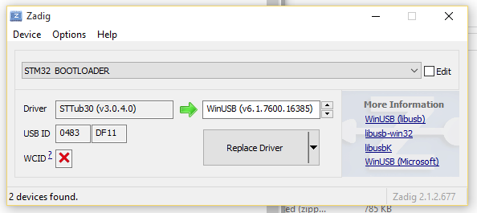

# USB Flashing
Some newer boards with full USB support must be flashed in USB DFU mode. This is a straightforward process in Configurator versions 0.67 and newer. The standard flashing procedure should work successfully with the caveat of some platform specific problems as noted below. The "No reboot sequence" checkbox has no effect as the device will automatically be detected when already in bootloader mode (a DFU device will appear in the connect dropdown if this is the case). The Full chip erase checkbox operates as normal. The baudrate checkbox is ignored as it has no relevance to USB.

### Charging-Only Cables
If you see no signs of life on your host computer when you plug in your board, check your cable with your mobile phone or some other USB device - some charging cables have only the power pins connected. These will power up the board, so the leds light up, but the host computer will not react to the device at all. You need a proper USB cable to connect your board to the Cleanflight Configurator.

## Platform Specific: Linux
Linux requires udev rules to allow write access to USB devices for users. An example shell command to achieve this on Ubuntu is shown here:
```
(echo '# DFU (Internal bootloader for STM32 MCUs)'
 echo 'SUBSYSTEM=="usb", ATTRS{idVendor}=="0483", ATTRS{idProduct}=="df11", MODE="0664", GROUP="plugdev"') | sudo tee /etc/udev/rules.d/45-stdfu-permissions.rules > /dev/null
```

This assigns the device to the plugdev group (a standard group in Ubuntu). To check that your account is in the plugdev group type `groups` in the shell and ensure plugdev is listed. If not you can add yourself as shown (replacing `<username>` with your username):
```
sudo usermod -a -G plugdev <username>
```

If you see your ttyUSB device disappear right after the board is connected, chances are that the ModemManager service (that handles network connectivity for you) thinks it is a GSM modem. If this happens, you can issue the following command to disable the service:
```
sudo systemctl stop ModemManager.service 
```

If your system lacks the systemctl command, use any equivalent command that works on your system to disable services. You can likely add your device ID to a blacklist configuration file to stop ModemManager from touching the device, if you need it for cellural networking, but that is beyond the scope of cleanflight documentation.

## Platform Specific: Windows
Chrome can have problems accessing USB devices on Windows. A driver should be automatically installed by Windows for the ST Device in DFU Mode but this doesn't always allow access for Chrome. The solution is to replace the ST driver with a libusb driver. The easiest way to do that is to download [Zadig](http://zadig.akeo.ie/). 
With the board connected and in bootloader mode (reset it by sending the character R via serial, or simply attempt to flash it with the correct serial port selected in Configurator): 
* Open Zadig
* Choose Options > List All Devices
* Select `STM32 BOOTLOADER` in the device list
* Choose `WinUSB (v6.x.x.x)` in the right hand box

* Click Replace Driver
* Restart Chrome (make sure it is completely closed, logout and login if unsure)
* Now the DFU device should be seen by Configurator

### Bricking your device

If you ever manage to brick your FC, that means, to put a firmware on it that does not work, the Cleanflight Configurator is not able to talk to it, and might not be able to reset it into DFU (Device Firmware Update, means: flashing) mode in order to overwrite the broken firmware with a good one.

This is where the "boot" pins on your FC come into play. If the two boot pins (might be named differently on your FC board) are connected with each other when the FC is powered up (in our case: connected to USB), the FC board will automatically start up in DFU (flashing) mode and identify itself not as a ACM or USB device (offering a serial interface) but as a DFU mode device. 

There is a special switch in the Cleanflight Configurator program 'No reboot sequence'. You should activate this if you power up your FC with boot pins connected to each other. What the switch does, is to avoid sending commands to the FC that should put the FC into DFU mode, and rather assume that the FC is already in DFU mode. 

Why do we care about not sending useless commands that try to achieve something that has already been achieved? 
The reason is that if you send this commands while already in DFU mode, there is a slight chance that the commands contain something that makes sense to the DFU mode command interpreter; if that happens, it might enter a state where flashing is no longer possible and hence, your system remains bricked.


# Troubleshooting, and some background (Linux)

Sometimes, connecting the Configurator program to the FC, or flashing the FC using the configurator, fail. The following section provides some background that help to identify the reason of the problem.

First, when connecting your FC to the computer, the LED on the board should light up - if they dont, your cable, your FC board, or your computer USB port are broken. If they do, wait a few seconds, then check whether your Linux and your board have properly established a connection. You do this with the `lsusb` command which will list all USB devices that are currently connected. In the example below, the FC was found as Device 025 on Bus 001. With `lsusb -vs bus:device`, detailed information about the device can be queried:

```
$ lsusb
Bus 001 Device 025: ID 0483:5740 STMicroelectronics STM32F407
$ sudo lsusb -vs 001:025
Bus 001 Device 025: ID 0483:5740 STMicroelectronics STM32F407
Device Descriptor:
  bLength                18
  bDescriptorType         1
  bcdUSB               2.00
  bDeviceClass            2 Communications
  bDeviceSubClass         0 
  bDeviceProtocol         0 
  bMaxPacketSize0        64
  idVendor           0x0483 STMicroelectronics
  idProduct          0x5740 STM32F407
  bcdDevice            2.00
  iManufacturer           1 STMicroelectronics
  iProduct                2 STM32 Virtual COM Port  
...
```
If your FC-device is not listed, Linux has not managed to connect to it. This might be a driver issue. For example, some FCs use a CP2102 chip that translates USB protocol to serial. On the USB side (on your Linux computer), a special driver is needed that knows how to speak with a CP2102 chip. This driver is a file "cp210x.ko" . If you have this driver available, but it is not active, you can install it into your system (and then, check whether it was installed) with

```
$ sudo modprobe cp210x
$ lsmod | grep cp210x
cp210x                 24576  0
usbserial              53248  1 cp210x
```

If `lsmod` shows the cp210x line, your system has successfully installed the driver.
If you do not have the driver on your system, you can download it from https://www.silabs.com/products/development-tools/software/usb-to-uart-bridge-vcp-drivers . Unpack the zip-File and follow the instructions (October 2017, the correct version was called 3.x.x/4.x.x and the instructions were in 'CP210x_VCP_Linux_3.13.x_Release_Notes.txt' which becomes visible only after unzipping).

Note that for devices that use the CP2102 chip, the FC might not show under its real name, but instead the CP2102 bridge chip is reported as USB device by your computer. For example, with a NAZE - which has a CP2102 - the `lsusb` command will give you
```
$ lsusb
Bus 001 Device 026: ID 10c4:ea60 Cygnal Integrated Products, Inc. CP210x UART Bridge / myAVR mySmartUSB light
```

After you checked that your Linux has hooked on with your FC, it is instructive to check the messages in the kernel message ring buffer. Here are the messages that are generated after first a NAZE is connected and disconnected again, then a SPRACINGF3EVO is connected, then the Cleanflight configurator is used to flash a new firmware on the SPRACINGF3EVO, and finally the SPRACINGF3EVO is disconnected. 
The command to read the kernel message ring buffer is `dmesg`:
```
$ sudo dmesg
# connect a NAZE
[ 8308.198937] usb 1-5: new full-speed USB device number 10 using xhci_hcd
[ 8308.328547] usb 1-5: New USB device found, idVendor=10c4, idProduct=ea60
[ 8308.328555] usb 1-5: New USB device strings: Mfr=1, Product=2, SerialNumber=3
[ 8308.328560] usb 1-5: Product: CP2102 USB to UART Bridge Controller
[ 8308.328563] usb 1-5: Manufacturer: Silicon Labs
[ 8308.328567] usb 1-5: SerialNumber: 0001
[ 8309.435542] usbcore: registered new interface driver usbserial
[ 8309.435583] usbcore: registered new interface driver usbserial_generic
[ 8309.435623] usbserial: USB Serial support registered for generic
[ 8309.450879] usbcore: registered new interface driver cp210x
[ 8309.450891] usbserial: USB Serial support registered for cp210x
[ 8309.450910] cp210x 1-5:1.0: cp210x converter detected
[ 8309.452253] usb 1-5: cp210x converter now attached to ttyUSB0
# disconnect the NAZE:
[ 8404.849369] usb 1-5: USB disconnect, device number 10
[ 8404.849739] cp210x ttyUSB0: cp210x converter now disconnected from ttyUSB0
[ 8404.849774] cp210x 1-5:1.0: device disconnected
# connect a SPRACINGF3EVO:
[ 9342.990591] usb 1-5: new full-speed USB device number 15 using xhci_hcd
[ 9343.102638] usb 1-5: device descriptor read/64, error -71
[ 9343.318613] usb 1-5: device descriptor read/64, error -71
[ 9343.534605] usb 1-5: new full-speed USB device number 16 using xhci_hcd
[ 9343.646691] usb 1-5: device descriptor read/64, error -71
[ 9343.862639] usb 1-5: device descriptor read/64, error -71
[ 9344.358639] usb 1-5: new full-speed USB device number 18 using xhci_hcd
[ 9344.488031] usb 1-5: New USB device found, idVendor=0483, idProduct=5740
[ 9344.488039] usb 1-5: New USB device strings: Mfr=1, Product=2, SerialNumber=3
[ 9344.488044] usb 1-5: Product: STM32 Virtual COM Port  
[ 9344.488048] usb 1-5: Manufacturer: STMicroelectronics
[ 9344.488051] usb 1-5: SerialNumber: 206830544234
[ 9344.488363] usb 1-5: ep 0x82 - rounding interval to 1024 microframes, ep desc says 2040 microframes
[ 9344.488919] cdc_acm 1-5:1.0: ttyACM0: USB ACM device
# start flashing the SPRACINGF3EVO by using the configurator (hit the 'Flash Firmware' button)
[ 9444.715745] usb 1-5: USB disconnect, device number 18
[ 9445.025906] usb 1-5: new full-speed USB device number 19 using xhci_hcd
[ 9445.154828] usb 1-5: New USB device found, idVendor=0483, idProduct=df11
[ 9445.154836] usb 1-5: New USB device strings: Mfr=1, Product=2, SerialNumber=3
[ 9445.154841] usb 1-5: Product: STM32  BOOTLOADER
[ 9445.154845] usb 1-5: Manufacturer: STMicroelectronics
[ 9445.154848] usb 1-5: SerialNumber: 206830542030
# here the flashing happens... then, once it is done, the following happens
#  (no intervention from the user)
[ 9466.888400] usb 1-5: USB disconnect, device number 19
[ 9467.326622] usb 1-5: new full-speed USB device number 20 using xhci_hcd
[ 9467.456005] usb 1-5: New USB device found, idVendor=0483, idProduct=5740
[ 9467.456014] usb 1-5: New USB device strings: Mfr=1, Product=2, SerialNumber=3
[ 9467.456018] usb 1-5: Product: STM32 Virtual COM Port  
[ 9467.456022] usb 1-5: Manufacturer: STMicroelectronics
[ 9467.456026] usb 1-5: SerialNumber: 206830544234
[ 9467.456325] usb 1-5: ep 0x82 - rounding interval to 1024 microframes, ep desc says 2040 microframes
[ 9467.456851] cdc_acm 1-5:1.0: ttyACM0: USB ACM device
# disconnect the SPRACINGF3EVO:
[ 9703.396560] usb 1-5: USB disconnect, device number 20
```

From this log file, you can see that the NAZE is resulting in a device called "ttyUSB0" and the SPRACINGF3EVO results in a device "ttyACM0". 

Sometimes, however, you get a problem and the freshly created device "ttyACMx" or "ttyUSBy" will be destroyed immediately after creation. This may look like this:
```
[ 2776.729734] cdc_acm 1-6:1.0: ttyACM0: USB ACM device
[ 2777.557676] usb 1-6: USB disconnect, device number 20
[ 2777.557864] cdc_acm 1-6:1.0: failed to set dtr/rts
```

Should you encounter this problem, it is probably the modem manager service that prevents Ubuntu from creating the device. Try killing it, and if that works, you might want to prevent it from restarting at the next reboot (here: for Ubuntu):
```
$ sudo systemctl --all | grep -i modem # lets find out the name of the service
  ModemManager.service  
$ sudo service ModemManager stop
$ # to make it persistent through reboot do:
$ sudo systemctl disable ModemManager
```

Now, you have a device, e.g. "ttyACM0" or "ttyUSB0". This device is found in the Linux file system at /dev/ttyACM0 or /dev/ttyUSB0. Have a look:
```
$ ll /dev/ttyACM0 
crw-rw---- 1 root root 166, 0 Okt 29 17:39 /dev/ttyACM0
```
The device is owned by user root, group root, and only people in the group "root" are allowed to use it. This is a problem (which is mentioned above already) - unless you are root, you can not write to your FC, so the Cleanflight configurator will fail.
It is possible to fix this issue by "chgrp" and "chmod" commands directly on the file /dev/ttyACM0. However, since USB devices are created on-the-fly when connection to the USB port happens, such a 'chmod' would have to be repeated every time when you plug in your board or after you switch off your computer.

In order to have something that springs automatically into action every time a new USB device is connected, you can create a so-called udev rule. Every time a new device is activated in the kernel - i.e. if you plug in your FC board via USB - the kernel checks all the udev rules (in Ubuntu, they are in /etc/udev/rules.d/). If one of them applies to the new device, it is used.
udev rules can - among other things - change the ownership, the group ownership, and the permissions of the new USB device file. So, a udev rule can be used to grant full access to the new USB device to everyone in a Unix group.

The rule needs to be smart - we do not want to have it applied to every USB device that is connected to the PC, like your USB stick or your mouse. It should only be applied to your FC. Luckily, this is possible, because USB devices tell the host computer a lot about themselves - they present things like their manufacturer and their product ID. So, the udev rule should apply only to Flight Controllers.

ST Microelectronics, the manufacturer of the microcontroller on your FC, has the (internationally standardized) USB Vendor ID '0483'. 


A udev rule which will put all STM microcontrollers into group "plugdev" can be established e.g. by 
```
(echo '# STM32 MCU)'
 echo 'SUBSYSTEMS=="usb", ATTRS{idVendor}=="0483", MODE="0664", GROUP="plugdev"') | sudo tee /etc/udev/rules.d/91-vendorSTM-group-plugdev.rules > /dev/null
```
(if you have no luck with it, try the more generic `KERNEL=="ttyACM[0-9]", GROUP="plugdev"` which sets any new USB device that is a ttyACM to group plugdev without checking whether it is a STM microcontroller).
Note you might need to reboot your system for the rule to take effect. Usually though, a reboot is not needed, stopping the udev system service and restarting it has the same effect:

```
$ sudo systemctl stop udev
$ sudo systemctl start udev
```
Connect your FC to USB, and then check the permissions of the resulting device file (e.g. /dev/ttyACM0). If the udev rule is set up properly, this device file should be group "plugdev" with group permissions "rw". Of course, you must be member of group "plugdev" to take advantage of it.


When looking into the output of 'dmesg' above, you will have noticed that when the Cleanflight Configurator program was flashing the firmware, the USB device 'STM32 virtual COM port' disappeared (device 18), and instead, a new device appeared - the device 19, "STM Bootloader". We can see that it has the idVendor 0483 and the idProduct df11. 
Every STM32 microcontroller has a special bootloader mode (the famous 'unbrickable bootloader', called DFU mode for Device Firmware Update) that identifies itself with a product ID of 'df11'. 

So, Cleanflight Configurator has made the FC to unplug itself (virtually) from your PC and to reconnect again as a different device!

Since your FC can function - and present itself to a USB host - as two different devices - a DFU bootloader device, which has commands to flash a firmware, and a serial interface, which can be used to speak the MultiWii protocol and talk to the Cleanflight Configurator (configuration section) - there might be two different Linux devices /dev/ttyXXX and /dev/ttyYYY corresponding to the two modes of your FC.

Therefore, it is entirely possible to have read-write permissions of one of the two devices set up properly, but not for the other. This will lead to the situation that you can either flash your device, but not configure it in the Configurator, or configure it, but not flash it. Therefore, you should have two udev rules in place - one for the serial device for configuring, one for the DFU mode device for flashing.


