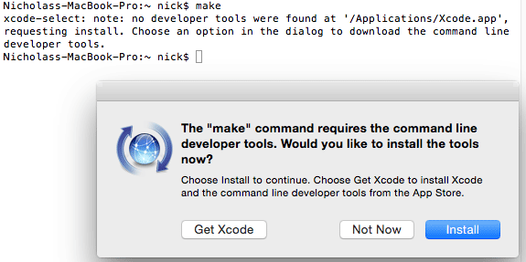

# Building in Mac OS X

Building in Mac OS X can be accomplished in just a few steps:

* Install general development tools (clang, make, git)
* Checkout firmware sourcecode through git
* Install ARM GCC compiler
* Build the code

## Install general development tools (clang, make, git)

Open up a terminal and run `make`. If it is installed already, you should see a message like this, which means that you
already have the required development tools installed:

```
make: *** No targets specified and no makefile found.  Stop.
```

If it isn't installed yet, you might get a popup like this. If so, click the "install" button to install the commandline
developer tools:



If you just get an error like this instead of a helpful popup prompt:

```
-bash: make: command not found
```

Try running `xcode-select --install` instead to trigger the popup.

If that doesn't work, you'll need to install the XCode development environment [from the App Store][]. After
installation, open up XCode and enter its preferences menu. Go to the "downloads" tab and install the 
"command line tools" package.

[from the App Store]: https://itunes.apple.com/us/app/xcode/id497799835

## Checkout firmware sourcecode through git

Enter your development directory and clone the firmware using the "HTTPS clone URL" which is shown on
the right side of the Cleanflight firmware GitHub page, like so:

```
git clone https://github.com/cleanflight/cleanflight.git
```

This will download the entire firmware repository for you into a new folder called "cleanflight".

[Cleanflight repository]: https://github.com/cleanflight/cleanflight

## Install ARM GCC compiler

To install the needed compiler you just need to enter the firmware directory and run `make arm_sdk_install`

## Build the code

Enter the firmware directory and run `make TARGET=SPRACINGF7DUAL` to build firmware for the SPRACINGF7DUAL. When the build completes,
the .hex firmware should be available as `obj/cleanflight_4.2.0_SPRACINGF7DUAL.hex` for you to flash using the
Configurator.

## Updating to the latest source

If you want to erase your local changes and update to the latest version of the firmware source, enter your
firmware directory and run these commands to first erase your local changes, fetch and merge the latest
changes from the repository, then rebuild the firmware (assuming you are on the git `master` branch still):

```
git reset --hard
git pull

make clean TARGET=SPRACINGF7DUAL
make TARGET=SPRACINGF7DUAL
```
