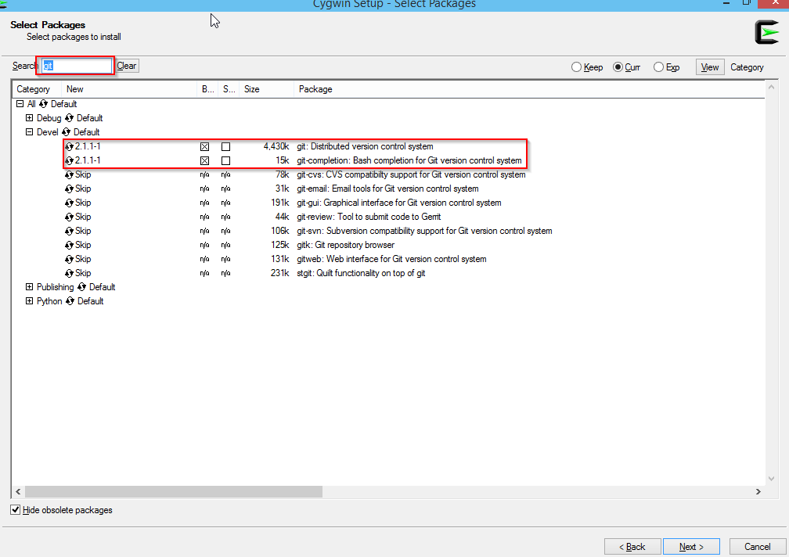
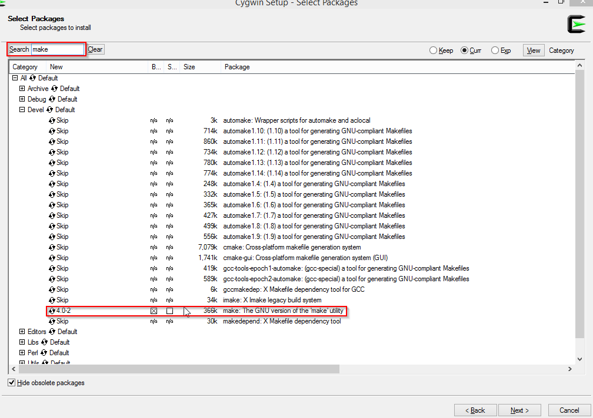
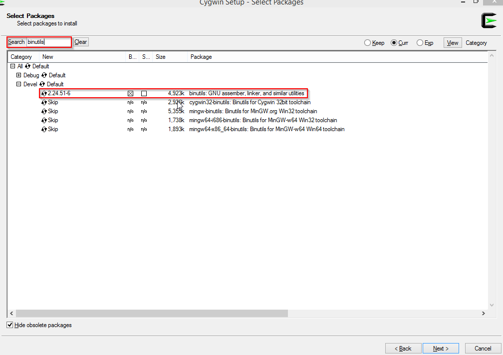
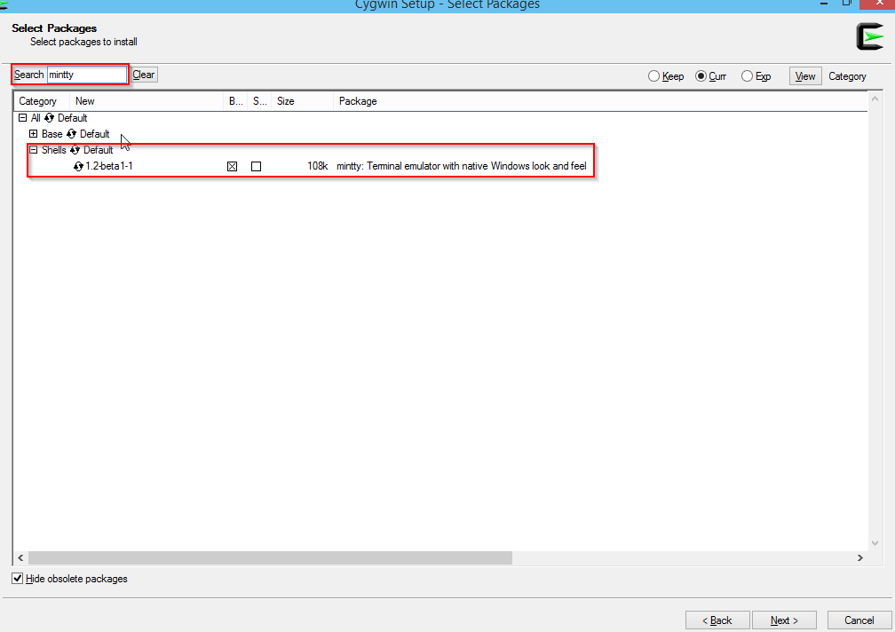
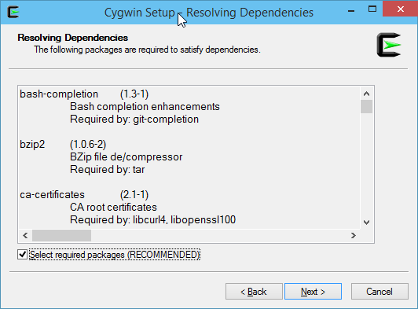
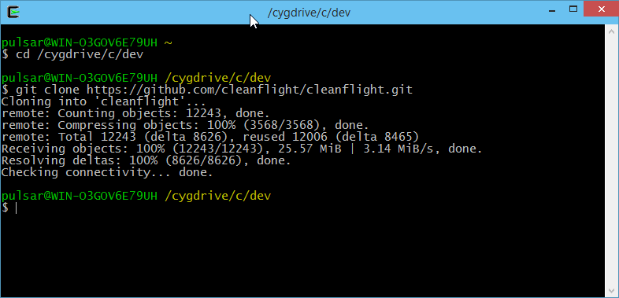
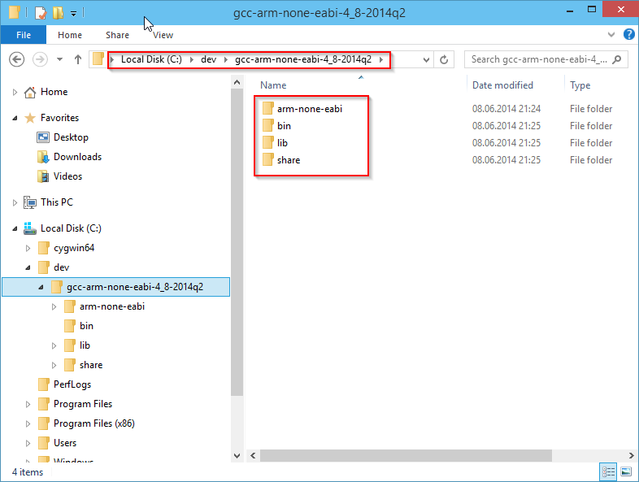
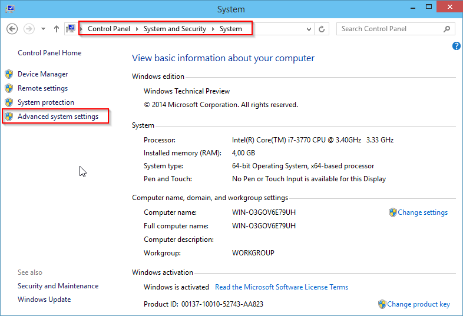
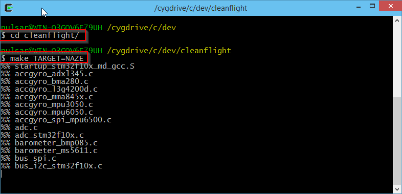

# Building in windows

For various reasons, a custom build of the firmware might be needed. A user might want to enable certain features that are disabled on his / her target, for example. This guide provides the basic instructions needed to build the firmware on a Windows system. Two options are given:

- Using the Linux subsystem (Windows 10 only)
- Using the Cygwin environment (Windows 7/8/10)

## Building on Windows 10 using the Linux subsystem

A new feature in Windows 10 allows any developer to quickly and easily run an entire linux subsystem in Windows and access it via a bash terminal. This gives developers full use of the entire Linux OS and all of the great existing linux tools and programs. When Bash for Windows is up and running it feels like you sshed into a full Linux box, except the linux distro is actually running alongside Windows locally.

If you use Bash on Windows you can easily build the firmware exactly as you would for Ubuntu. [For instructions follow the official guide here.](https://msdn.microsoft.com/commandline/wsl/install_guide)

- https://msdn.microsoft.com/commandline/wsl/install_guide

Once you have Bash On Windows running you can follow the "Building in Ubuntu" instructions for building the firmware.

## Building on Windows 7/8/10 using the Cygwin environment

The Cygwin environment provides some functionality similar to a Linux distribution, allowing to build the firmware in a relatively small (~1 Gb) environment within Windows.

### Installing Cygwin and required packages

Download the Setup*.exe from https://www.cygwin.com/


Execute the downloaded Setup*.exe and step through the installation  wizard (no need to customize the settings here). Stop at the  "Select Packages" Screen and select the following Packages
for Installation:

- Archive/unzip
- Devel/git
- Devel/bash-completion (was git-completion, Optional)
- Devel/make
- Devel/binutils
- Editors/vim	 or  Editors/nano  (file editors, `nano` is most straightforward while `vim` offers more advanced options)
- Shells/mintty (should be already selected)
- Archive/unzip










Continue with the Installation and accept all autodetected dependencies.



The Cygwin environment is now installed and can be used with the `Cygwin-Terminal` application.

### Clone the git repository

Head over to the firmware Github page and grab the URL of the GIT Repository: "https://github.com/cleanflight/cleanflight.git"


Open the Cygwin-Terminal, navigate to the `/dev` folder and use the git command `git clone` to checkout the repository.

```bash
cd /dev
git clone https://github.com/cleanflight/cleanflight.git
```


The `/dev/cleanflight` folder now holds a copy of the current firwmare source code repository.

### Setup GNU ARM Toolchain

To compile the Betafligth source code for the ARM processors used on the various flight controllers, the GNU ARM Toolchain is required. Versions are important, current firmware (4.2.0) requires at least ```arm-none-eabi-gcc``` version ```9.2.1```. 

The toolchain can be installed in two ways:

- Using the provided `arm_sdk_install` script
- Manual installation

The provided script will install the correct version of the ARM toolchain to the `/dev/cleanflight/` directory, which will thus only be avaialble to this project. This method ensures the corerct version is installed and prevents collision with possible other projects you might have.

The manual installation option will install the ARM toolchain system-wide, allowing it to also be used for other projects on the system, should that be necesary.

#### Scripted installation

To install the ARM toolchain, use the `make arm_sdk_install` command within the `/dev/cleanflight` directory:

```
Stefan@DESKTOP-U5FUCGO /dev
$ cd /dev/cleanflight

Stefan@DESKTOP-U5FUCGO /dev/cleanflight
$ make arm_sdk_install
mkdir -p tools
mkdir -p downloads
  % Total    % Received % Xferd  Average Speed   Time    Time     Time  Current
                                 Dload  Upload   Total   Spent    Left  Speed
100   241  100   241    0     0    241      0  0:00:01 --:--:--  0:00:01  1288
100  124M  100  124M    0     0  1965k      0  0:01:05  0:01:05 --:--:-- 2014k
```

The ARM toolchain is now installed. Note the toolchain can be removed with `make arm_sdk_clean` from the `/dev/cleanflight` directory.

#### Manual Installation

Manual installation requires you download the Windows zip ```7.3.1``` (7-2018-q2-update), which can be obtained here:

 - https://developer.arm.com/open-source/gnu-toolchain/gnu-rm/downloads (7-2018-q2-update)

Or via direct link:

 - https://armkeil.blob.core.windows.net/developer/Files/downloads/gnu-rm/7-2018q2/gcc-arm-none-eabi-7-2018-q2-update-win32.zip

Extract the contents of this archive to any folder of your choice, for instance ```C:\dev\gcc-arm```. 



Add the "bin" subdirectory to the PATH Windows environment variable: ```%PATH%;C:\dev\gcc-arm\bin```




The ARM toolchain is now available within the Cygwin environment.

#### Building the firmware

To compile the firmware binaries; open the Cygwin terminal, enter the firmware directory and build the project using the `make` command. You can append TARGET=[HARDWARE] if you want to build anything other than the default NAZE target:

```bash
cd /dev/cleanflight
make TARGET=SPRACINGF3
```



Within few moments you should have your binary ready:

```bash
Stefan@DESKTOP-U5FUCGO /dev/cleanflight
$ cd /dev/cleanflight

Stefan@DESKTOP-U5FUCGO /dev/cleanflight
$ make TARGET=SPRACINGF3
make -j ./obj/cleanflight_4.2.0_SPRACINGF3.hex
make[1]: Entering directory '/dev/cleanflight'
%% startup_stm32f30x_md_gcc.S
%% (optimised) ./src/main/startup/system_stm32f30x.c
...
...
%% (optimised) ./src/main/drivers/usb_io.c
Linking SPRACINGF3
Memory region         Used Size  Region Size  %age Used
           FLASH:      241016 B       252 KB     93.40%
    FLASH_CONFIG:          0 GB         4 KB      0.00%
             RAM:       33568 B        40 KB     81.95%
             CCM:          2 KB         8 KB     25.00%
       MEMORY_B1:          0 GB         0 GB     -1.#J%
   text    data     bss     dec     hex filename
 237600    3416   32200  273216   42b40 ./obj/main/cleanflight_SPRACINGF3.elf
Creating HEX ./obj/cleanflight_4.2.0_SPRACINGF3.hex
```

Note that the final message will also inform you about flash space use

You can use the Configurator to flash the `obj/cleanflight_SPRACINGF3.hex` file.

### Updating and rebuilding

In order to update your local copy of the source code, navigate to the local firmware repository and use the following steps to pull the latest changes and rebuild your version of the firmware:

```bash
cd /dev/cleanflight
git reset --hard
git pull
make clean TARGET=SPRACINGF3
make TARGET=SPRACINGF3
```
