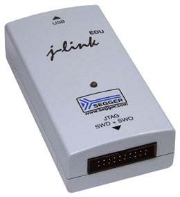
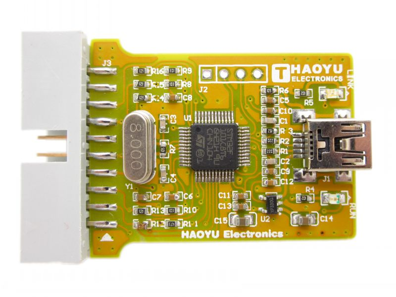
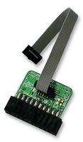
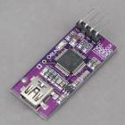
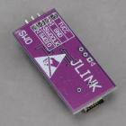
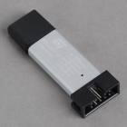

# Hardware debugging

The code can be compiled with debugging information, you can then upload a debug version to a board via a JLink/St-Link debug adapter and step through the code in your IDE.

More information about the necessary hardware and setting up the eclipse IDE can be found [here](Hardware Debugging in Eclipse.md)

A guide for visual studio can be found here:
http://visualgdb.com/tutorials/arm/st-link/

This video is also helpful in understanding the process:
https://www.youtube.com/watch?v=kjvqySyNw20

## Hardware

Various debugging hardware solutions exist, the Segger J-Link clones are cheap and are known to work on Windows with both the Naze and Olimexino platforms.

### J-Link devices

Segger make excellent debuggers and debug software.

#### Segger J-Link EDU EDU version, for hobbyists and educational use.

https://www.segger.com/j-link-edu.html

#### USB-MiniJTAG J-Link JTAG/SWD Debugger/Emulator

http://www.hotmcu.com/usbminijtag-jlink-jtagswd-debuggeremula%E2%80%8Btor-p-29.html?cPath=3_25&zenid=fdefvpnod186umrhsek225dc10

##### ARM-JTAG-20-10 adapter

https://www.olimex.com/Products/ARM/JTAG/ARM-JTAG-20-10/
http://uk.farnell.com/jsp/search/productdetail.jsp?sku=2144328

#### CJMCU-STM32 Singlechip Development Board Jlink Downloader Jlink ARM Programmer

http://www.goodluckbuy.com/cjmcu-stm32-singlechip-development-board-jlink-downloader-jlink-arm-programmer.html

### STLink V2 devices

STLink V2 devices can be used too, via OpenOCD.

#### CEPark STLink V2

http://www.goodluckbuy.com/cepark-stlink-st-link-v2-emulator-programmer-stm8-stm32-downloader.html

## Software Pre-requisites

### Toolchain

Follow the build guide ([Mac OS X](Building in Mac OS X.md), [Ubuntu](Building in Ubuntu.md), [Windows](Building in Windows.md)) to install the arm toolchain.

### GDB Server
The GDB server exposes a standard GDB debugging API useful in GDB or other IDEs. Internally, it uses the SWD or JTAG interface to the microcontroller.

#### Segger J-Link
The J-Link software is used in conjunction with J-Link devices listed above.

The Segger J-Link GDB server can be obtained from [here](http://www.segger.com/jlink-software.html).

#### OpenOCD
OpenOCD is short for Open On-Chip-Debugger and serves as a bridge between the SWD/JTAG interface to the microcontroller and standard debugging interfaces such as GDB server.

##### OSX
Install via [brew](http://brew.sh/).

    brew install openocd

##### Linux

###### Arch

    pacman -S openocd

## Compiling for debugging

Use `DEBUG=GDB` make argument.

    make TARGET=NAZE DEBUG=GDB

You may find that if you compile all the files with debug information on that the program is too big to fit on the target device.  If this happens you have some options:

* Compile all files without debug information (`make clean`, `make ...`), then re-save or `touch` the files you want to be able to step though and then run `make DEBUG=GDB`.  This will then re-compile the files you're interested in debugging with debugging symbols and you will get a smaller binary file which should then fit on the device.
* You could use a development board such as an Olimexino or an EUSTM32F103RB, development boards often have more flash rom.

### Running GDB debug server

The GDB server runs in the background as you debug to forward the commands you issue to the microcontroller.

#### J-Link

##### Windows

Run the Launch the J-Link GDB Server program and configure using UI.

#### OpenOCD

##### Windows

STM32F103 targets

    "C:\Program Files (x86)\UTILS\openocd-0.8.0\bin-x64\openocd-x64-0.8.0.exe" -f interface/stlink-v2.cfg -f target/stm32f1x_stlink.cfg

STM32F30x targets

    "C:\Program Files (x86)\UTILS\openocd-0.8.0\bin-x64\openocd-x64-0.8.0.exe" -f scripts\board\stm32f3discovery.cfg

##### Linux

STM32F30x targets

      openocd -f /usr/share/openocd/scripts/board/stm32vldiscovery.cfg

##### OSX
STM32F3 Discovery

    openocd -f /usr/local/Cellar/open-ocd/0.9.0/share/openocd/scripts/board/stm32f3discovery.cfg

### Debugging in GDB with OpenOCD

> Note: These examples were tested on a STM32F3 Discovery board. Simply change the target and it should still work for you.

#### Loading and running.

Build the debug binary.

> Note: Shell commands are prefixed with `$` and gdb commands with `(gdb)` for clarity. The prefixes shouldn't actually be entered in.

    $ make TARGET=STM32F3DISCOVERY DEBUG=GDB

Next run gdb (from the Cleanflight root directory) with the debug binary you wish to run.

    $ arm-none-eabi-gdb obj/main/cleanflight_STM32F3DISCOVERY.elf

Now, everything else is done through gdb. First, we connect gdb to OpenOCD.

    (gdb) target extended-remote localhost:3333

Commands that start with `monitor` are passed verbatim to OpenOCD. Before loading the new binary, we reset and stop the CPU. This is also useful if you want to go back to the beginning of the program.

    (gdb) monitor reset halt

Now, load the new program that was specified on the command line.

    (gdb) load

At this point the new program is loaded but halted and now we run it.

    (gdb) continue

> Beware `(gdb) run` doesn't work.

This command won't return so you need to `CTRL-C` in order to stop it. This will halt the program and you can inspect the stack.

    (gdb) backtrace

You can also step to the next source code line.

    (gdb) step

To restart do

    (gdb) monitor reset halt
    (gdb) continue

#### Breakpoints

Breakpoints are used to stop the program after a `(gdb) continue` at a specific point. Here is how to stop at the start of main.

    (gdb) hbreak main

> Note: `hbreak` is used instead of `break` because it relies on the microcontroller *hardware* breakpoint to stop itself.

Its also possible to stop at a particular source code line.

    (gdb) hbreak main.c:535

See all of the breakpoints you've set.

    (gdb) info breakpoints

Remove the breakpoints we added.

    (gdb) clear main
    (gdb) clear main.c:535
