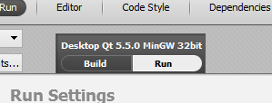

Overview
=================

General description
------------------------

Building Cleanflight for running on PC allows to test
and verify in-flight and overal behaviour without
using real hardware.

Let's call this mode the "SIL" mode (Software-in-loop).

In SIL mode all main logic (PIDs,navigation,control logic,etc.)
are shared with that goes onto hardware. The main difference is that 
instead of using hardware i/o devices (sensors,motors,servos,etc.)
those devices are emulated according to flight model of
software flight simulator.

Software flight model simulation (curently) is done by flight simulator
called "X-Plane" (http://www.x-plane.com/desktop/home/).
This flight simulator actually calculates flight behaviour of
airplane/helicopter/multirotor/car/boat or other flying stuff.

Simulated devices and I/O
------------------------
X-Plane have a lot of expansion capability, including I/O of various data, including:
- output of linear acceleration (used to simulate ACC)
- output of angular velocities  (used to simulate GYR)
- output of compass readings
- output of pressure            (used to simulate BARO)
- output of battery status      (used to simulate ADC readings of voltage and amperage)
- input  of throttle            (used to simulate PWM motor output)
- input  of control surfaces    (used to simulate PWM servo output)
- output of NMEA                (used to simulate GPS)

Currently these devices NOT simulated:
- MAG, due lack of 3-axis vector magnetic field data
- SONAR, due lack of distance to ground with respect to tilt/roll angles

In SIL mode these I/O are used:
- input  UDP stream on port 49003 for receiving simulated data from X-Plane
- output UDP stream to 127.0.0.1:49000 for sending simulated data to X-Plane
- input/output to serial ports (see next)
- input from joystick/gamepad for simulating PPM input

Typical usage diagram:
Cleanflight  --> (servos/motors over UDP) --> X-Plane
Cleanflight  <-- (sensor over UDP)        <-- X-Plane
Cleanflight  <-> (data over serial ports) <-> other software/hardware

Typical serial port usage diagram:
Cleanflight  <--virtual port 1-->  (data over serial port)  <--virtual port 2-->  Configurator
Cleanflight  <--virtual port 3-->  (NMEA over serial port)  <--virtual port 4-->  X-Plane

Serial ports
------------------------
In SIL mode serial ports are automatically connected to system serial ports:
- USART1      connects to COM20
- USART2      connects to COM21
- USART3      connects to COM22
- SOFTSERIAL1 connects to COM23
- SOFTSERIAL2 connects to COM24

These ports can be actual hardware serial ports, or emulated by 3rd party software ports.
The "VSPE" sofware (http://www.eterlogic.com/Products.VSPE.html) can be used to create virtual
serial port pairs (Virtual port 1 <--> Virtual port 2 ).

Devices, which usually connect to serial ports can be:
- real devices connected to PC
- simulated devices (X-Plane NMEA output, for example)

You can use regular Cleanflight configuration software with SIL mode.
Pair of connected serial ports is required (real or virtual) for this:
one is for Cleanflight, another for Configurator.

 
 
Building and running
============================

Recommended software
------------------------
- Windows OS (for joystick support).
- Qt Creator (http://download.qt.io/official_releases/qt/5.5/5.5.1/qt-opensource-windows-x86-mingw492-5.5.1.exe
- X-Plane flight simulator (http://www.x-plane.com/desktop/home/).
- Virtual Serial Ports Emulator (http://www.eterlogic.com/Products.VSPE.html) 

Building
------------------------
- Open "sil/project/cleanflight-sil.pro" file with Qt Creator.

- If promted to configure project, enter directories where to put files. Recommended to use directory outside of Cleanflight (temp directory for example).

- Open "Projects" tab, select "Run" tab, set "Working directory" to full path of "x_plane/data" directory.

- press "Build" button

Running
------------------------

Press green "Run" button in Qt Creator .

If everything is fine, then you'll see main window:

This is GUI of SIL mode of Cleanflight.

Currently there are:
- LED1, LED2, LED3 color indicators
- OLED display (it's off by default configuration)
- serial ports status

Configuring virtual serial ports
------------------------------------
Launch your favorite serial ports emulator software (for example, VSPE).

Create virtual serial port pairs.

Remember that SIL mode connects to ports COM20 ... COM24.

For example, configure as provided on screenshot:

Configuring X-Plane
-----------------------------
X-Plane (currently) must be launched on same PC.

- open "Settings/Net connections" main menu item.
- select "Data" tab
- make sure that "port that we receive on" is 49000
- check "IP of data receiver ..." checkbox
- enter "127.0.0.1" in left field
- enter "49003" in right field
- close sub-window

- open "Settings/Joystick & Equiment" main menu item.
- select "Equipment tab"
- check "moving map ot other NMEA GPS-driver device" checkbox
- select "com-port" to port, that is attached to GPS port of Cleanflight.
  X-Plane will send NMEA data to this port.
  It's better to use port from COM1 ... COM9 (there are some problems with >= COM10).

Configuring Cleanflight
-----------------------------
Launch your favorite configurator (for example, cleanflight-configurator).
Connect to serial port which is paired/connected with one that is used for MSP (USART1 by default).
Use as usual.
